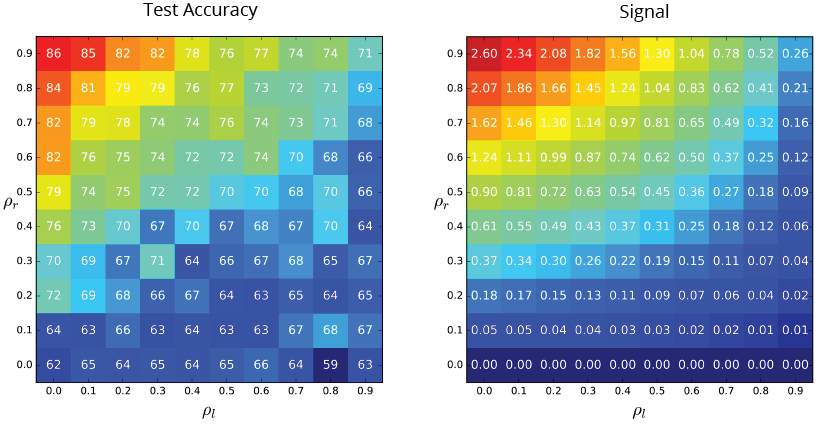
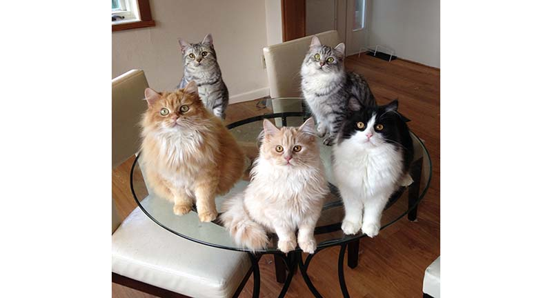

> **TLDR of TLDR**: With a dataset over "cats or dogs" labels, you are not going to learn a table detector even if cats appear on tables more often than dogs.

> **TLDR**: Current state-of-the-art deep learning models for transfer learning are mostly trained with supervised learning. However, their abilities to transfer are entirely limited by the expressiveness of labels. Unsupervised learning methods, on the other hand, do not suffer this problem, and thus have the potential to learn all the useful features in the data.

Since the advent of AlexNet , deep convolutional networks pretrained on ImageNet have been used for a variety of tasks. These include transfer learning to a new task , generating visually realistic data , and efficient evaluation of generative models . These methods are based on one premise - that these pretrained models contain "rich features" that are generally useful in the larger domain.

However, there are few investigations over how "rich" these features exactly are. Do deep models trained using supervised learning learn all the useful features for transfer? We answer this question in [a recently submitted ICLR workshop paper](https://arxiv.org/pdf/1703.02156.pdf). (The answer is no.)

### Feature Learning with Discriminative Models

We introduce a concept called **feature learning**. In feature learning, we assume that features emerge from the weights of a deep neural network, so that learning a neural network is essentially learning features at the same time. If we have learned $$k-1$$ features, $$\{f_i\}_{i=1}^{k-1}$$, then the ease of learning a new feature $$f_k$$ is measured by the "information gain" when we add it:

$$
\text{signal}(f_k) = I(y; f_k\vert f_1, f_2, \ldots, f_{k-1})
$$

where $$y$$ is the label [^dataset]. Therefore, a larger signal indicates that learning this new feature *while conditioning on the previous ones* will have better preditive performance on the current task. However, the sum of all the signals is bounded by the entropy of the labels:

$$
\sum_{i=1}^{k} \text{signal}(f_i) = I(y; f_1, \ldots, f_k) \leq H(y)
$$

Note that this is independent of the size of the dataset. This suggests that the existence of previous features will negatively affect the ability to learn new features.

With a infinite dataset over "cats or dogs" labels, learning cat face and dog face features will reduce the signal for learning feature for table detector. Therefore we hypothesize that highly predictive features, such as cat face and dog face features, will prevent learning of less predictive features such as tables. We refer to this hypothesis as **"feature competition"**.

To test whether this is reasonable, we conduct the following experiment with two MNIST digit in the same input image. We would like to know if features learned for the label of the left digit will prevent learning features for the right digit. This is analagous to the hypothetical "cats, dogs, and tables" dataset where the left digits are "cats and dogs" and the right digits have "tables".

In the feature extraction phase, we train with only the label for the left digit, and obtain separate "feature extractors" for both digits $$f_l$$ and $$f_r$$, which is the input for the top fully-connected layer. In the feature evaluation phase, we fix $$f_l$$ and $$f_r$$, and plug in a new fully-connected layer to train over the label for the right digit. We use the test accuracy in the evaluation phase to approximate the quality of features learned in $$f_r$$ - higher test accuracy would suggest that $$f_r$$ learned "better" features in the extraction phase.

{:.center}

During the extraction phase, we randomly corrupt the left digit (to make it totally indistinguishable) by probability $$(1 - \rho_l)$$, and force the right digit to have the same label with the left one by probability $$\rho_r$$. Therefore, the signal for learning the right digit would be:

$$
\begin{align}\
\text{signal}(f_r) &= I(y; f_r \vert f_l) = H(y \vert f_l) - H(y \vert f_r, f_l) \\
&= (1 - \rho_l) (H(y) - H(y \vert f_r))
\end{align}
$$

which increases if $$\rho_l$$ decreases or $$\rho_r$$ increases.

The following figure are two heatmaps for the test accuracy and the signal of $$f_r$$ under different settings of $$\rho_l$$ and $$\rho_r$$. This validates our assumption that a higher signal makes learning the feature easier.

{:.center}

Interestingly, if $$\rho_l$$ is high then $$f_r$$ would learn almost nothing even when $$\rho_r$$ is as high as 0.5 due to the "feature competition" phenomenon. Hence, to learn a table detector with a "cats and dogs" dataset, we actually need *the majority of* cats to sit on a table.

{:.center}

### Feature Learning with GANs

On the other hand, some generative models using unsupervised methods tend to avoid this feature competition and has the potential to learn all the features. This might seem trivial for autoencoding models such as VAE , but not so for GANs . In the paper, we point out that the discriminator in the GAN framework does not suffer from "feature competition", and has the potential to learn all the features.

For the discriminator, it is presented with a dataset over two labels - 1 for real data, and 0 for generated data. We assume that the discriminator is always at "a state of confusion" where it always assigns probability 0.5 to both real data and fake data [^bsgan]. Therefore, $$H(y \vert f_1, \ldots, f_{k-1}) = 1$$, and the signal for learning a new feature then becomes:

$$
\begin{align}\
I(y; f_k \vert f_1, \ldots, f_{k-1}) &= H(y \vert f_1, \ldots, f_{k-1}) - H(y \vert f_1, \ldots, f_{k-1}, f_k) \\
&= 1 - H(y \lvert f_1, \ldots, f_{k-1}, f_k) \\
& \geq 1 - H(y \vert f_k)
\end{align}
$$

If the generated distribution does not yet match the data distribution, then the value above is greater than zero. Importantly, this value has no dependence over the previous features, which effectively eliminates the "feature competition" phenomenon that plagues labeled supervision.

We empirically test this using the same "evaluation-extraction" setting with $$f$$ being a convolutional neural network, and $$\rho_l = 0, \rho_r = 0$$ (no corrption in left digit, no correlation with right digit). We consider vanilla CNNs, Autoencoders, GANs and Wasserstein GANs with the same neural network as $$f$$.

| Model                     | CNN   | AE    | GAN   | WGAN  |
| :------------------------ | ----- | ----- | ----- | ----- |
| Accuracy (w/ extraction)  | 67.93 | 89.95 | 90.38 | 91.37 |
| Accuracy (w/o extraction) | 84.31 | 82.18 | 82.27 | 84.97 |

GAN and WGAN have accuracy that is on par with AE, while CNN performs even worse than random initializing the weights of $$f$$. This is because in the extraction phase $$f_r$$ is completely ignored during the learning of $$f_l$$.

### Discussion

In this post, we discuss the limitations of learning transferrable features using label-based supervised learning. Current practice, however, tend to take CNN features trained on ImageNet as granted, such as the Inception score for measuring the "quality" of generated samples. While these methods seems to be successful [^imagenet], one should also realize their limitations. We propose that further exploration be done in the direction of unsupervised representation learning.

#### References



#### Footnotes

[^dataset]: We assume that we have infinite data in this article; the dataset size affects other aspects of feature learning.
[^bsgan]: Note that the generator is not allowed to "fool" the discriminator, but only reach the decision boundary. If the condition is not satisfied then the argument would break (see Appendix A of our paper). This is also the intuition behind Boundary Seeking GANs .
[^imagenet]: This is thanks to the highly expressive labels in ImageNet. Our theory also provides a strong motivation for datasets like Visual Genome, since the key to improving supervised feature learning is more expressive labels.

